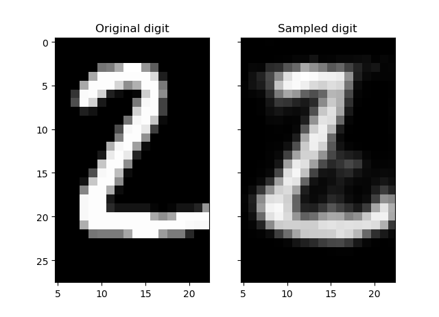

# Restricted Boltzmann Machine (RBM) for MNIST reconstruction

TensorFlow implementation of a Restricted Boltzmann Machine (RBM) for MNIST digits reconstruction.

Check this [video](https://www.youtube.com/watch?v=JKw4z2tKl_4) for some background.

Credits to [@patricieni](https://github.com/patricieni/RBM-Tensorflow)

## Requirements
- Python 2.7 or 3.5
- [TensorFlow 1.0.1+](https://www.tensorflow.org/install/)

## RBM Graphical Model

Restricted Boltzmann Machines are a class of undirected probabilistic graphical models where the nodes in the graph are random variables.

An RBM can be considered a stochastic neural network where you have a set of visible nodes that take some data as input and a set of hidden nodes that encode a lower dimensional representation of that data.

The model is defined in the rbm.py file, together with methods for computing the probabilities and free energy of the system as well as sampling. The goal is to learn the joint probability distribution that maximizes the probability over the data, also known as likelihood.

- Joint probability distribution: p(v,h) = e^{-E(v,h)}/Z

- Energy E(v,h) = -v^{T}Wh -v^{T}b - h^{T}c

- Free Enery p(v) = sum_{h}p(v,h} = e^{-F(v)}/Z

- Derivation

## Inference

The Conditional distribution factorizes (no intra layer connections): p(h_{j}=1|v) = sigmoid(c_{j}+v^{T}W_{j}) and p(v_{i}=1|h) = sigmoid(b_{i}+Wh_{i})

## Learning

The parameters of our model are the weights W and the biases b, c. The following image is the feature detectors map, ie t

Use the RBM for learning a lower dimensional representation of the MNIST dataset. You can see the reconstructions in both cases and how it's slightly better in the gaussian scenario.

Contrastive divergence after 1 sampling step:

Positive divergence: $\mathbf{v_0^T \times p(h_0|v_0)}$
Sample hidden states from: $\mathbf{h_0 \sim p(h_0|v_0)}$.
Reconstruct visible units: $\mathbf{v_s \sim p(v_{s})=p(v_1|h_0)}$
Negative divergence: $\mathbf{p(v_{s})^T \times p(h_1|v_s)}$

Update rules for weights and biases.

$w_{new} = w_{old} + \epsilon *$ (positive divergence - negative divergence)
$vb_{new} = vb_{old} + \epsilon * (v_0 - p(v_s))$
$vb_{new} = vb_{old} + \epsilon * (p(h_0) - p(h_1))$

## Usage

Run the main.ipynb file in jupyter

## Results

Under progress

## Extensions

Deep Boltzmann Machines and Deep Belief Networks.

Contrastive Divergence k (for k>1 step of MCMC simulation) w/ weight cost or temperature [Tieleman 08]. [video](https://www.youtube.com/watch?v=S0kFFiHzR8M) for Persistent Contrastive Divergence.

...
